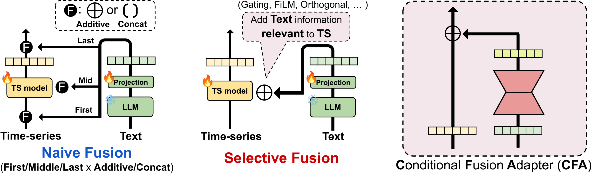

# On the Importance of Selective Fusion for Multimodal Time Series Forecasting

<!--
## Citation
If you find this repository useful, please cite our paper:
```bibtex
@inproceedings{lee2026cfa,
  title={...},
  author={...},
  booktitle={Advances in Neural Information Processing Systems (NeurIPS)},
  year={2026}
}
```
-->

## Overview

This repository provides a unified evaluation framework for **multimodal fusion strategies** in time series forecasting.
We systematically investigate how text information from large language models (LLMs) can be integrated into diverse time series backbone architectures through various fusion methods.

<br>

### **Overview of Conditional Fusion Adapter (CFA)**

<div align="center">
  
</div>

Key contributions:
- **10 fusion methods** (6 naive + 4 selective) evaluated across **14 time series backbones** and **4 text encoders**
- **9 real-world datasets** spanning different domains and temporal frequencies
- Modular architecture enabling plug-and-play combination of any backbone, text encoder, and fusion strategy

## Project Structure

```
cfa/
├── run.py                          # Main experiment runner
├── run_financial.py                # Financial dataset runner
├── scripts/
│   └── run_timemmd.sh              # Main experiment script
├── exp/
│   ├── exp_basic.py                # Base experiment class
│   ├── exp_long_term_forecasting_text_integrated.py
│   └── exp_long_term_forecasting_financial.py
├── models/                         # 17 backbone models with fusion support
│   ├── iTransformer.py
│   ├── PatchTST.py
│   ├── Autoformer.py
│   └── ...
├── layers/                         # Custom layers including text fusion
│   ├── text_fusion.py
│   ├── Transformer_EncDec.py
│   ├── Embed.py
│   └── ...
├── data_provider/                  # Data loading utilities
├── utils/                          # Metrics, tools, augmentation
└── environment.txt                 # Full dependency list
```

## Experimental Settings

### Datasets

We use 9 datasets from [Time-MMD](https://github.com/AdityaLab/Time-MMD) across diverse domains:

| Domain | Dataset | Frequency |
|:---|:---|:---:|
| Agriculture | US Retail Broiler Composite | Monthly |
| Climate | US Precipitation | Monthly |
| Economy | US Trade Balance | Monthly |
| Energy | US Gasoline Price | Weekly |
| Environment | New York AQI | Daily |
| Public Health | US Flu Ratio | Weekly |
| Security | US FEMA Grant | Monthly |
| Social Good | US Unemployment Rate | Monthly |
| Traffic | US VMT | Monthly |

### Models

| Category | Type | Models |
|:---|:---|:---|
| **Time Series** | Transformer | Nonstationary Transformer, PatchTST, iTransformer, Crossformer, FEDformer, Autoformer, Reformer, Informer, Transformer |
| | Linear / MLP | DLinear, TiDE, TSMixer |
| | Others | Koopa, FiLM |
| **Text Encoder** | — | BERT, GPT-2, Llama 3, Doc2Vec |

### Forecasting Horizons

| Frequency | Horizons (*H*) | Lookback | Label |
|:---:|:---|:---:|:---:|
| Daily | 48, 96, 192, 336 | 96 | 48 |
| Weekly | 12, 24, 36, 48 | 36 | 18 |
| Monthly | 6, 8, 10, 12 | 8 | 4 |

### Learning Rates

For each combination of dataset, backbone, and horizon, the best learning rate is selected from:

`{5e-6, 1e-5, 5e-5, 1e-4, 2e-4, 5e-4, 1e-3, 2e-3, 5e-3, 1e-2}`

### Fusion Methods

| Category | Type | Methods |
|:---|:---|:---|
| **Naive** | Additive | First (Input), Middle (Intermediate), Last (Output) |
| | Concat | First (Input), Middle (Intermediate), Last (Output) |
| **Selective** | — | Gating, FiLM, Orthogonal, **CFA (Ours)** |


## Multimodal Datasets

Download datasets from [Time-MMD](https://github.com/AdityaLab/Time-MMD) and place them under `./data/` following the directory structure:
```
data/
├── Algriculture/
├── Climate/
├── Economy/
├── Energy/
├── Environment/
├── Public_Health/
├── Security/
├── SocialGood/
└── Traffic/
```

## Running Experiments

Run the full experiment suite:

```bash
bash scripts/run_timemmd.sh
```

This iterates over all combinations of:
- 14 backbone models
- 4 text encoders (BERT, GPT-2, Llama 3, Doc2Vec)
- 11 fusion modes (including unimodal baseline)
- 10 learning rate multipliers
- 9 datasets with frequency-appropriate horizons

Results are saved to `./results/`.

## Acknowledgements

This codebase builds upon [Time-MMD](https://github.com/AdityaLab/Time-MMD).

## Contact

Seunghan Lee — seunghan.lee@lgresearch.ai
